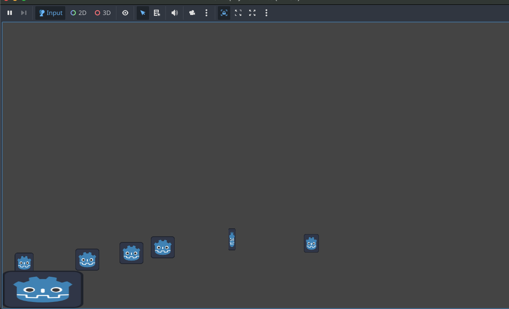

# Game Development Activities

All of my game development activities.

## Activity No.
1. Simple Scene With A Moving Node
   - A Scene with a Shooting-Like Control which spawns (shoots) a **Hello World** Text in a specific direction using Arrow Keys.

2. Gameplay Mechanics
   - A simple parkour game showing basic physic movements with respawn functionality when falling off.
   
   